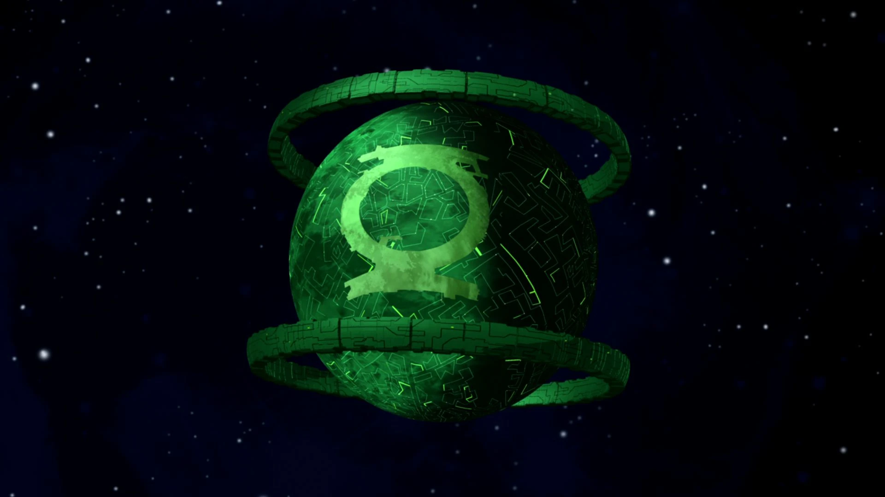
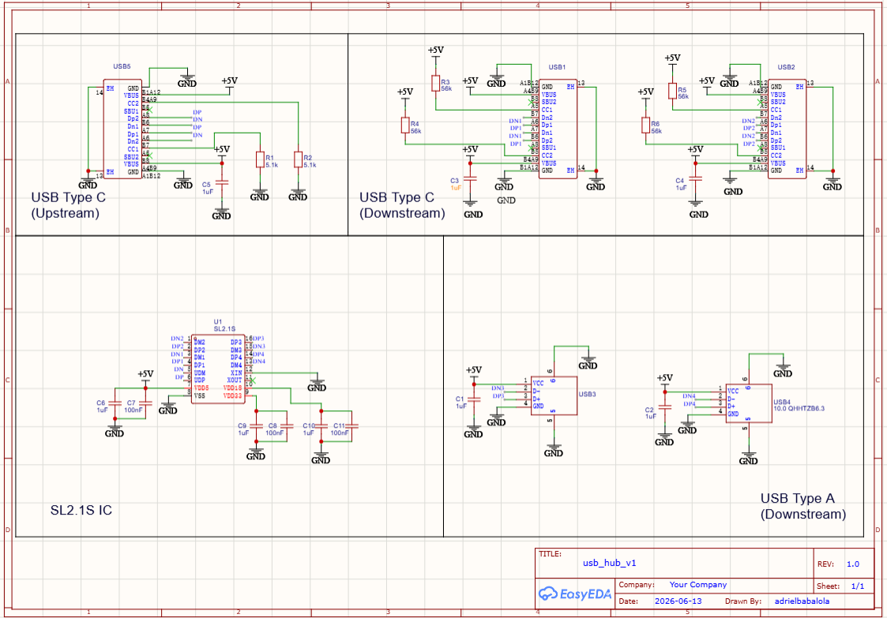
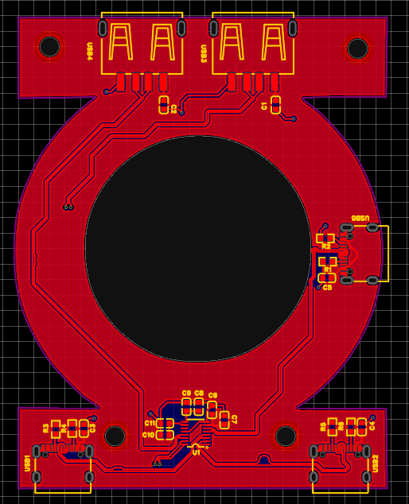
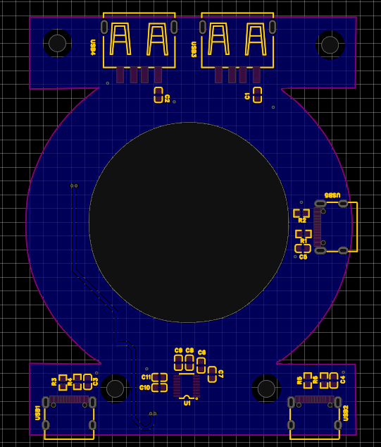
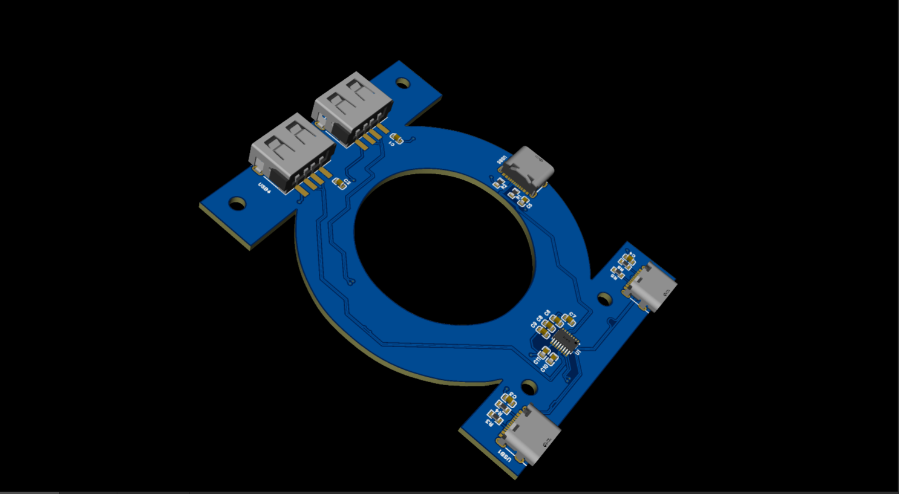
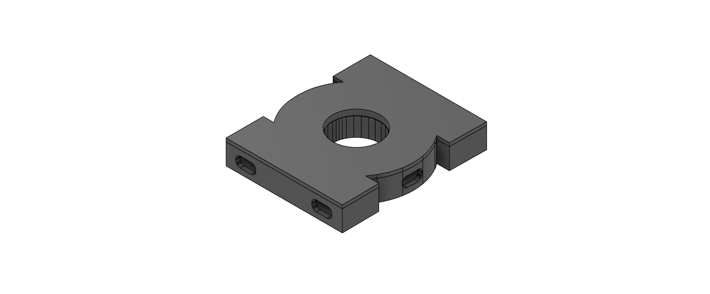
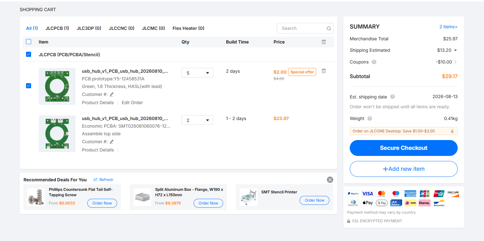

# Oa : USB Hub

**Oa** : a USB hub inspired by the green lantern's homeworld, Oa.

It takes a single upstream port, feeds the data through an SL2.1S hub IC, and splits it out to 4 downstream USB ports. the config is 2 USB Type C and 2 USB Type A connectors, giving you flexibility in what you can plug in.
I built this to learn EasyEDA since i was coming from KiCad and wanted to expand my toolkit. figured a USB hub was the perfect project.

The flow goes like : an upstream port > SL2.1S > 4 downstream ports. power and data all properly routed.

**Components:**

- **SL2.1S Hub IC** (C2684433) : the brain. splits one USB port into four.
- **USB Type C Connectors** (C2765186) : 1 upstream, 2 downstream.
- **USB Type A Connectors** (C668591) : 2 downstream. 
- **5.1 kΩ Pull-Down Resistors** : for the upstream Type C CC pins. 
- **56 kΩ Pull-Up Resistors** : for the downstream Type C CC pins. it negotiates power delivery on the downstream side.
- **1 µF Decoupling Capacitors** : smooths power on each port and the IC.
- **100 nF Decoupling Capacitors** : filters high-frequency noise on the IC's internal rails.

**PCB**
Designed in EasyEDA, a two layer PCB. The board uses a copper pour strategy of 5V on the top layer and ground on the bottom layer, to cleanly connect all the power and ground pads without messy individual traces.

**EasyEDA Link**: [https://oshwlab.com/adrielbabalola/project_bbkpbvgo](https://oshwlab.com/adrielbabalola/project_bbkpbvgo)

**NOTE !***
To view or make enhancements to this PCB design using EasyEDA Pro:
- Clone or download this repository to your local machine.Open EasyEDA Pro in your browser or desktop app and log in.
- Click File (F) > Open > EasyEDA... (or Import >EasyEDA) and select the .epro file inside the pcb/ directory.

**Schematics**

**PCB Layers**

**Top Layer (+5v)**

**Bottom Layer (Ground)**

**Top**

**CAD**

**CASE**

**Base**

**LID**

**JLCPCB PCBA Quote**

## Bill of Materials

| Component | Value | Qty | Designator | Part Number | Supplier | Notes |
|-----------|-------|-----|-----------|------------|----------|-------|
| **ICs & Chips** |
| USB Hub IC | SL2.1S | 1 | U1 | C2684433 | LCSC | CoreChips  the brain of the hub |
| **Connectors** |
| USB Type-C Receptacle | TYPE-C 16PIN 2MD(073) | 3 | USB1, USB2, USB5 | C2765186 | LCSC | 1 upstream + 2 downstream |
| USB Type-A Receptacle | 10.0 QHHTZB6.3 | 2 | USB3, USB4 | C668591 | LCSC | 2 downstream |
| **Resistors** |
| Pull-Down Resistor | 5.1 kΩ | 2 | R1, R2 | — | LCSC | USB-C upstream CC pins |
| Pull-Up Resistor | 56 kΩ | 4 | R3, R4, R5, R6 | — | LCSC | USB-C downstream CC pins |
| **Capacitors** |
| Decoupling Capacitor | 1 µF | 8 | C1, C2, C3, C4, C5, C6, C9, C10 | — | LCSC | Bulk decoupling on power rails |
| Decoupling Capacitor | 100 nF | 3 | C7, C8, C11 | — | LCSC | High-frequency noise filtering on IC |
| **Manufacturing** |
| PCB Fabrication | 2-layer | 5 | — | — | JLCPCB | Green, 1.6mm thickness, HASL |
| PCBA Assembly | SMT Assembly | 2 | — | — | JLCPCB | Top-side assembly |

### Totals
- **Components only:** ~$3.50 (LCSC parts)
- **PCB + Assembly (5 boards):** ~$35.97 (JLCPCB)

**Credits**
 This porject Uses :
 - EasyEDA
 - [@notaroomba](https://github.com/notaroomba/) git hub for readme strcture 
 - [@GarageTinkering](https://www.youtube.com/@GarageTinkering) Fpr Case tutorial [Link](https://www.youtube.com/watch?v=7ax-VmkeHrE&list=PPSV)

