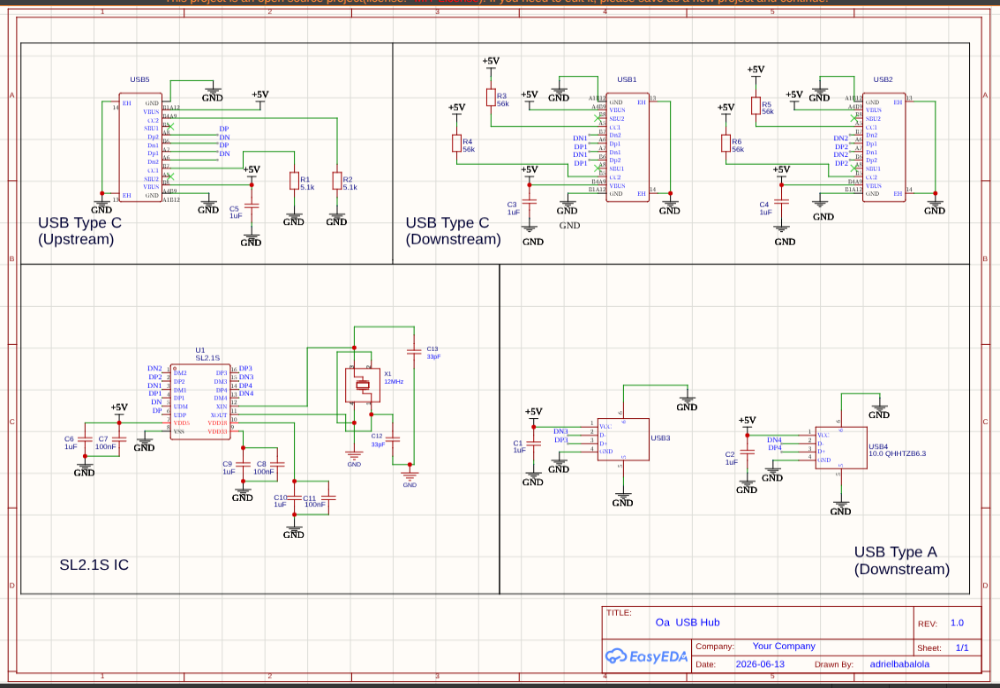
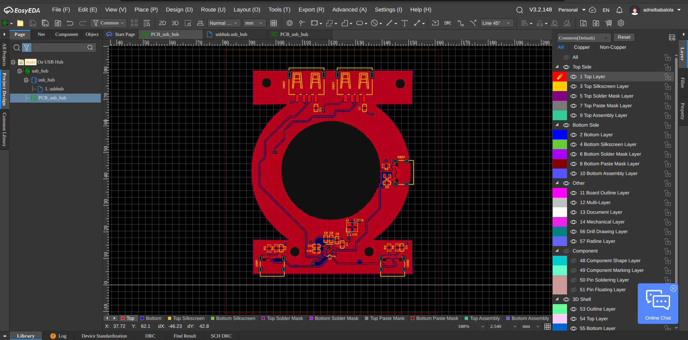
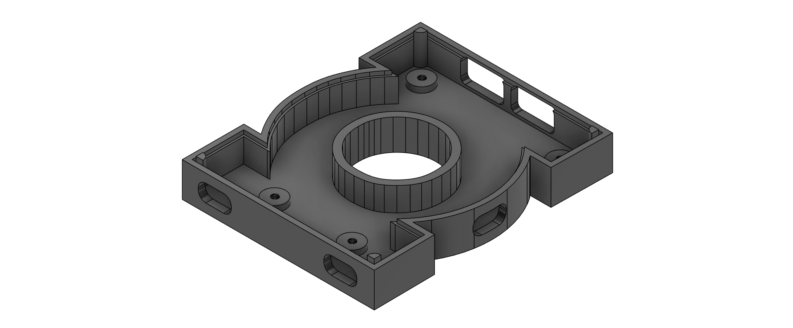
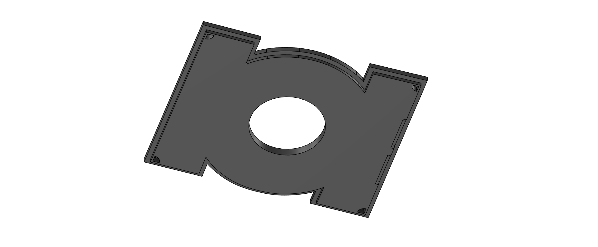
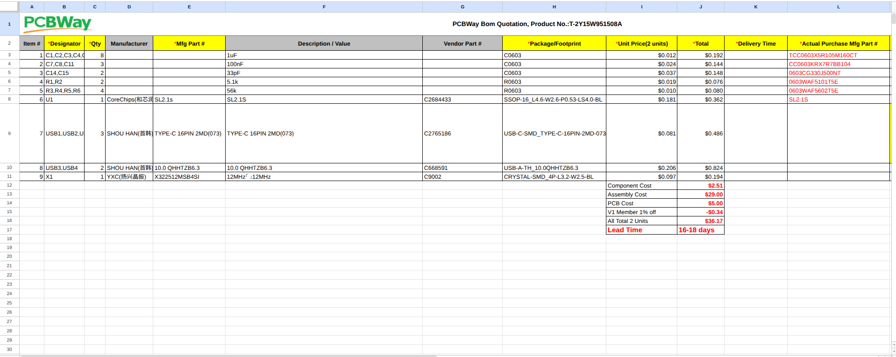

# Oa : USB Hub

  

**Oa** : A USB hub inspired by the Green Lantern's homeworld, Oa.

It takes a single upstream port, feeds the data through an SL2.1S hub IC, and splits it out to 4 downstream USB ports. The configuration features 2 USB Type-C and 2 USB Type-A downstream ports, giving you flexibility in what you can plug in.

I built this to learn EasyEDA since I was transitioning from KiCad and wanted to expand my toolset. A USB hub felt like the perfect practical project.

The architecture flows cleanly from:

**Upstream Port → SL2.1S Hub IC → 4 Downstream Ports**

with all power distribution and differential data lines properly routed.

---

## Recent Updates

After reviewing the design again, I made a few changes before sending it for manufacturing:

* Added a **12 MHz crystal resonator** connected to the SL2.1S XIN and XOUT pins.
* Added the required **33 pF crystal load capacitors**.
* Revisited and adjusted the **USB differential pair routing** after adding the external clock.
* Ran through the PCB design and DRC again after the changes.
* Updated the **BOM** with the new clock components and final manufacturing information.
* Switched the manufacturing order from **JLCPCB to PCBWay** because the PCBWay quote was more suitable for this build.
* Updated the project files and BOM on **GitHub**.

---

## Components

* **SL2.1S Hub IC** (C2684433): The brain. Splits one USB port into four downstream paths.

* **12 MHz Crystal Resonator** (C9002): Provides the external clock reference for the SL2.1S.

* **USB Type-C Connectors** (C2765186): 1 upstream input, 2 downstream outputs.

* **USB Type-A Connectors** (C668591): 2 downstream outputs.

* **5.1 kΩ Pull-Down Resistors** (C14677): Form the necessary voltage configuration on the upstream Type-C CC pins to establish a device connection.

* **56 kΩ Pull-Up Resistors** (C23206): Positioned on the downstream Type-C CC lines.

* **1 µF Decoupling Capacitors** (C15849): Provides bulk capacitance to help smooth voltage fluctuations across the power rails.

* **100 nF Decoupling Capacitors** (C14663): High-frequency noise filtering positioned close to the IC power inputs.

* **33 pF Load Capacitors** (C1663): Connected to the XIN and XOUT crystal lines to provide the required crystal loading.

---

## PCB Design

Designed as a standard 2-layer FR4 board in EasyEDA.

The board uses a split copper plane strategy consisting of a **5V copper pour on the top layer** and a solid **Ground (GND) pour on the bottom layer**. This handles power distribution while helping reduce signal loop areas without requiring separate power traces throughout the board.

The USB differential pairs were routed with attention to their spacing and length matching. After adding the external 12 MHz crystal, I also revisited the routing to make sure the updated design was clean and ready for manufacturing.

---

[EasyEDA Project](https://oshwlab.com/adrielbabalola/project_bbkpbvgo)

---

To view or enhance this PCB design using EasyEDA Pro:

* Clone or download this repository to your local machine.
* Open EasyEDA Pro in your browser or desktop app and log in.
* Click **File (F) > Open > EasyEDA...** or **Import > EasyEDA**.
* Select the `.epro` file inside the `pcb/` directory.

---

## Schematics

---

## PCB Layout

---

## CAD Enclosure

### CASE

### Base

### Lid

---
## Assembly Instructions

Once the PCB has been manufactured and assembled, place the completed PCBA into the 3D-printed base and align the PCB mounting holes with the mounting pillars. Secure the PCB to the base using **M2.5 screws**, making sure the board is sitting flat and the USB ports line up correctly with the case openings. After the PCB is secured, place the lid over the base and align it with the four corner pillars. Press the lid down until it sits securely in place. Finally, connect a USB cable to the upstream Type-C port and plug it into a host device to power and test the hub. The four downstream USB ports can then be used to connect USB devices.

---

## PCBWay PCBA Quote

---

## BOM

| Category       | Component             | Value          | Qty | Part #   | Supplier  | Unit Cost | Total Cost | Notes            |
| -------------- | --------------------- | -------------- | --- | -------- | --------- | --------- | ---------- | ---------------- |
| ICs & Chips    | USB Hub IC            | SL2.1S         | 1   | C2684433 | LCSC      | $1.20     | $1.20      | CoreChips engine |
| Clock Crystals | Crystal Resonator     | 12MHz 20pF     | 1   | C9002    | LCSC      | $0.15     | $0.15      | 3225 SMD         |
| Connectors     | USB Type-C Receptacle | 16-PIN SMD     | 3   | C2765186 | LCSC      | $0.50     | $1.50      | 1 up + 2 down    |
| Connectors     | USB Type-A Receptacle | 10.0 QHHTZB6.3 | 2   | C668591  | LCSC      | $0.30     | $0.60      | 2 downstream     |
| Resistors      | Pull-Down Resistor    | 5.1 kΩ         | 2   | C14677   | LCSC      | $0.01     | $0.02      | Upstream CC      |
| Resistors      | Pull-Up Resistor      | 56 kΩ          | 4   | C23206   | LCSC      | $0.01     | $0.04      | Downstream CC    |
| Capacitors     | Decoupling Capacitor  | 1 µF           | 8   | C15849   | LCSC      | $0.02     | $0.16      | Power dist       |
| Capacitors     | Decoupling Capacitor  | 100 nF         | 3   | C14663   | LCSC      | $0.01     | $0.03      | Noise filter     |
| Capacitors     | Crystal Load Cap      | 33 pF          | 2   | C1663    | LCSC      | $0.02     | $0.04      | Load matching    |
| Manufacturing  | PCB Fabrication       | 2-layer 1.6mm  | 5   | —        | PCBWay    | $4.00     | $4.00      | HASL finish      |
| Manufacturing  | PCBA Assembly         | Economic SMT   | 2   | —        | PCBWay    | $26.30    | $26.30     | Auto assembly    |
| Manufacturing  | 3D Case Enclosure     | Custom Housing | 1   | —        | 3D Vendor | $15.00    | $15.00     | CAD case         |

---

## Cost Summary

* **Components (LCSC):** $3.74
* **PCB + PCBA (PCBWay):** $30.30
* **3D Case:** $15.00
* **TOTAL:** ~$49.04

---

## Credits & Inspiration

 This project relies on and was inspired by:
 - **EasyEDA Pro Canvas** development suite.
 - [@notaroomba](https://github.com) GitHub layout for the structural README layout inspiration.
 - [@GarageTinkering](https://youtube.com) Fusion 360 enclosure modeling process [Video Link](https://youtube.com).

 Thank you [@hackclub](https://github.com/hackclub) : )